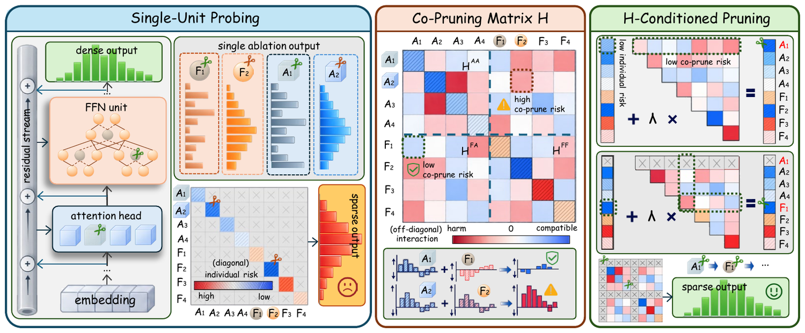
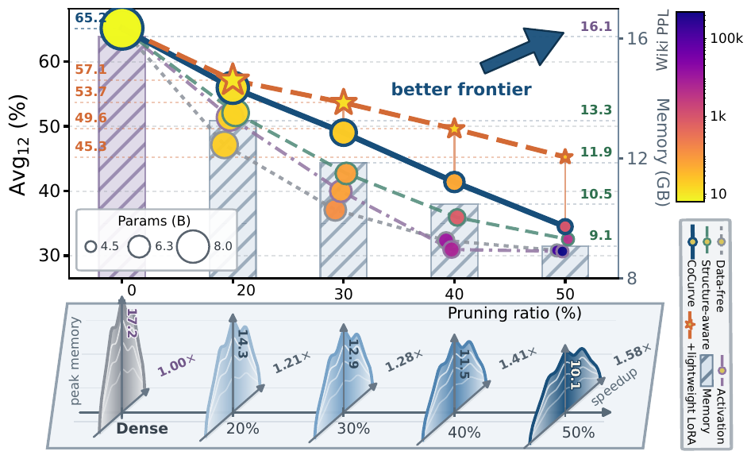

<div align="center">

# CoCurve

### Cross-Module Co-Pruning Curvature for Structured LLM Pruning

**CoCurve treats structured pruning as a set-dependent decision: it measures
how removals interact, then conditions every pruning step on what has already
been removed.**

<table>
  <tr>
    <td align="center">
      <a href="https://arxiv.org/abs/2607.17568"><strong>📄 Read the paper</strong></a><br>
      <sub>Method, theory, and complete results</sub>
    </td>
    <td align="center">
      <a href="https://gongzhiren.github.io/CoCurve-website/"><strong>🌐 Explore the project</strong></a><br>
      <sub>Visual story and interactive results</sub>
    </td>
    <td align="center">
      <a href="https://gongzhiren.github.io/CoCurve-website/tutorial.html"><strong>▶ Watch the tutorial</strong></a><br>
      <sub>A guided walkthrough of CoCurve</sub>
    </td>
    <td align="center">
      <a href="#publication-locked-artifacts"><strong>📦 Use the artifacts</strong></a><br>
      <sub>Evaluate without rebuilding curvature</sub>
    </td>
  </tr>
</table>

[](https://arxiv.org/abs/2607.17568)
[](https://www.python.org)
[](#publication-locked-artifacts)
[](https://github.com/GongZhiren/CoCurve/actions/workflows/ci.yml)
[](LICENSE)

[Why CoCurve?](#why-cocurve) · [Results](#headline-results) · [Quick start](#quick-start) · [Artifacts](#publication-locked-artifacts) · [End to end](#end-to-end-reproduction) · [VLMs](#vision-language-models) · [Reproducibility](REPRODUCIBILITY.md)

</div>

<p align="center">
  
</p>

<p align="center"><em>CoCurve turns single-unit forward ablations into a signed co-pruning matrix, then uses its node and edge risks to select one joint attention–FFN structure.</em></p>

## News

- **September 2026 — complete paper reproduction release.** Added the final
  LLM/VLM implementation, all 42 publication masks and curvature matrices,
  direct evaluation, exact mask reconstruction, recovery and quantization
  recipes, physical slicing, tests, and release checks.
- **July 2026 — initial release.** Released the first LLM CoCurve pipeline.

## Why CoCurve?

Most structured pruners assign each unit one score and keep that ranking fixed.
CoCurve starts from a different observation: the risk of pruning a unit changes
with the units already removed. It therefore builds one shared inventory of
attention and feed-forward units and represents their joint predictive risk as:

- **nodes** — individual removal risk from the diagonal of the Fisher Gram matrix;
- **edges** — reinforcement or cancellation between pairs of removals;
- **conditional decisions** — incremental risk under the current pruned set,
  rather than a fixed unit ranking or a separate attention/FFN allocation.

The matrix is obtained from one forward ablation per unit. No labels, gradients,
or quadratic pairwise intervention sweep are required.

## Headline results

<table>
  <tr>
    <td align="center"><strong>6 LLMs</strong><br><sub>3B–70B, 10–50% pruning</sub></td>
    <td align="center"><strong>3 VLMs</strong><br><sub>7 multimodal benchmarks</sub></td>
    <td align="center"><strong>53 / 60</strong><br><sub>first-place PPL comparisons</sub></td>
    <td align="center"><strong>15 / 15</strong><br><sub>first-place 70B PPL points</sub></td>
  </tr>
  <tr>
    <td align="center"><strong>+2.2–6.6 pts</strong><br><sub>more pruning in 9/10 matched-quality cases</sub></td>
    <td align="center"><strong>1.58×</strong><br><sub>prefill throughput vs. dense</sub></td>
    <td align="center"><strong>−41%</strong><br><sub>peak memory vs. dense</sub></td>
    <td align="center"><strong>6 / 6</strong><br><sub>first-place VLM Avg7 blocks</sub></td>
  </tr>
</table>

<p align="center">
  
</p>

<p align="center"><em>One view of the measured quality–deployment frontier: pruning changes parameter count, memory, and throughput, while lightweight recovery exposes the retained structure's recovery boundary.</em></p>

## Quick start

### Install

The paper curvature matrices are tracked with Git LFS (about 58 MiB total).

```bash
git lfs install
git clone https://github.com/GongZhiren/CoCurve.git
cd CoCurve
python -m venv .venv
source .venv/bin/activate
python -m pip install --upgrade pip
python -m pip install -e .
```

Install only the optional paths you need:

```bash
python -m pip install -e '.[recovery]'      # LoRA
python -m pip install -e '.[quantization]'  # NF4 / INT8
python -m pip install -e '.[vlm]'           # vision-language models
python -m pip install -e '.[all]'           # all of the above
```

Some checkpoints are gated. Accept their Hugging Face licenses and run
`hf auth login` before evaluation.

### Choose a reproduction path

| Goal | Cost | Command |
|---|---:|---|
| Verify the release | CPU, seconds | `cocurve-artifacts verify` |
| Rebuild a paper mask from released `H` | CPU, seconds | `python scripts/reproduce_paper_mask.py --model llama-3.1-8b-instruct --ratio 30` |
| Evaluate the exact released mask | One model forward pass | `python scripts/evaluate_paper_mask.py --model llama-3.1-8b-instruct --ratio 30 --tasks wikitext` |
| Rebuild curvature and selection end to end | GPU, model-dependent | [End-to-end reproduction](#end-to-end-reproduction) |

The no-GPU mask check ends with exact set agreement:

```json
{
  "model": "llama-3.1-8b-instruct",
  "ratio": 30,
  "match": true,
  "symmetric_difference": 0
}
```

To run the full three-corpus and 12-task suite, first materialize the fixed
local evaluation snapshots and then request all tasks:

```bash
python scripts/prepare_paper_datasets.py
python scripts/evaluate_paper_mask.py \
  --model llama-3.1-8b-instruct --ratio 30 --tasks all
```

## Publication-locked artifacts

The release contains the exact provenance chain for every reported CoCurve
operating point:

```text
artifacts/paper-v1/{llm,vlm}/<model>/
├── registry.json                       ordered units and parameter costs
├── matrices/H.npy                      publication co-pruning curvature
├── rXX/masks/prune_solution.json       exact evaluated mask and protocol
└── rXX/reference_metrics.json          machine-readable reference results
```

| Family | Public model key | Released ratios | Paper precision |
|---|---|---:|---|
| LLM | `llama-3.2-3b` | 10, 20, 30, 40, 50% | bf16 |
| LLM | `falcon3-7b` | 10, 20, 30, 40, 50% | bf16 |
| LLM | `llama-3.1-8b-instruct` | 10, 20, 30, 40, 50% | bf16 |
| LLM | `mistral-nemo-12b` | 10, 20, 30, 40, 50% | bf16 |
| LLM | `mistral-small-24b` | 10, 20, 30, 40, 50% | bf16 |
| LLM | `llama-3.1-70b-instruct` | 10, 20, 30, 40, 50% | NF4 |
| VLM | `qwen2.5-vl-7b` | 20, 30, 40, 50% | bf16 |
| VLM | `qwen3-vl-8b` | 20, 30, 40, 50% | bf16 |
| VLM | `internvl3-8b` | 20, 30, 40, 50% | bf16 |

`manifest.json` binds every file by byte size and SHA256. Verification also
checks matrix shape, finiteness, symmetry, non-negative diagonal, registry
ordering, mask partition, and parameter-budget consistency. Run all 42 exact
solver checks with:

```bash
make verify-paper-masks
```

The released mask is the primary provenance object. It is the exact unit set
used for the corresponding reference metrics—not a mask regenerated later from
rounded paper values.

## End-to-end reproduction

The commands below rebuild the full LLM path. Defaults match the paper: 128 C4
calibration sequences of length 2048, 16 disjoint held-out sequences, top-256
teacher support, KV-aligned attention groups, and 16 FFN groups per layer.

<details>
<summary><strong>1. Build the calibration and held-out splits</strong></summary>

```bash
python scripts/build_calibration_mix.py \
  --project-root . --source c4 --no-fallback \
  --num-samples 128 --holdout-samples 16 --seq-len 2048 \
  --tokenizer meta-llama/Llama-3.1-8B-Instruct
```

</details>

<details>
<summary><strong>2. Collect ablations and construct H</strong></summary>

```bash
RUN=outputs/llama8b
CFG=configs/paper.yaml

python scripts/run_collect_full.py \
  --config $CFG --model-key llama-3.1-8b-instruct --run-dir $RUN
python scripts/run_unit_ablations.py \
  --config $CFG --model-key llama-3.1-8b-instruct --run-dir $RUN
python scripts/run_build_H.py \
  --config $CFG --model-key llama-3.1-8b-instruct --run-dir $RUN
```

</details>

<details>
<summary><strong>3. Select interaction strength and solve the budget</strong></summary>

```bash
python scripts/select_lambda.py \
  --config $CFG --model-key llama-3.1-8b-instruct \
  --h $RUN/matrices/H.npy \
  --holdout data/calibration/calibration_holdout.jsonl \
  --ratio 0.30 --output $RUN/selection
```

This enumerates the exact critical-value path over `lambda in [0, 1]`, scores
each distinct mask by held-out teacher KL, and never tunes on downstream tasks.

</details>

<details>
<summary><strong>4. Evaluate, recover, or physically slice</strong></summary>

```bash
# Full quality evaluation
python scripts/run_standard_eval.py \
  --config $CFG --model-key llama-3.1-8b-instruct \
  --run-dir $RUN/eval --mask-run-dir $RUN/selection --tasks all

# Paper lightweight recovery; compact adapter saved by default
python scripts/run_lora_recovery.py \
  --config $CFG --model-key llama-3.1-8b-instruct \
  --mask-run-dir $RUN/selection --out $RUN/recovery

# True sliced-matrix efficiency; measure on an otherwise idle GPU
python scripts/run_efficiency_eval.py \
  --config $CFG --model-key llama-3.1-8b-instruct \
  --run-dir $RUN/efficiency --mask-run-dir $RUN/selection \
  --mode physical_slice
```

Dense and sliced efficiency runs must use the same isolated GPU, software
stack, sequence length, batch, warm-up, and repeat count.

</details>

## Vision-language models

CoCurve uses one shared budget across the language and vision towers. The paper
builds `H` from 128 Flickr30k image-caption pairs, selects interaction strength
on 48 disjoint pairs, and evaluates seven benchmarks with 1,000 items each.

<details>
<summary><strong>Build H, select a mask, and evaluate</strong></summary>

```bash
python scripts/vlm_build_h.py \
  Qwen/Qwen2.5-VL-7B-Instruct outputs/qwen25vl/H \
  --n 128 --top-r 64 --ffn-groups 16

python scripts/run_vlm.py \
  Qwen/Qwen2.5-VL-7B-Instruct outputs/qwen25vl/H \
  outputs/qwen25vl/r30.json --ratio 0.30 --limit 1000
```

</details>

<details>
<summary><strong>Evaluate a released VLM mask directly</strong></summary>

```bash
python scripts/run_vlm.py \
  Qwen/Qwen2.5-VL-7B-Instruct \
  artifacts/paper-v1/vlm/qwen2.5-vl-7b/matrices \
  outputs/qwen25vl/released-r30.json --ratio 0.30 \
  --mask artifacts/paper-v1/vlm/qwen2.5-vl-7b/r30/masks/prune_solution.json
```

</details>

<details>
<summary><strong>Run the common VLM recovery recipe</strong></summary>

```bash
python scripts/recover_vlm.py \
  Qwen/Qwen2.5-VL-7B-Instruct \
  artifacts/paper-v1/vlm/qwen2.5-vl-7b/r30/masks/prune_solution.json \
  outputs/qwen25vl/recovery-r30
```

The default recipe uses rank 128, alpha 256, 3,000 mixed visual-instruction
examples, global batch 16, a frozen vision tower, and a trained multimodal
projector.

</details>

## Quantization and recovery

- `--precision nf4` evaluates a released mask with NF4, double quantization,
  and bf16 compute.
- `--precision int8` evaluates the same structural mask with LLM.int8.
- `run_lora_recovery.py` applies the paper's identical rank-16 LoRA recipe and
  saves a compact adapter by default.
- Quantization and recovery never alter which structural units the released
  mask selects.

## Repository layout

```text
src/cocurve/        LLM inventory, curvature, selection, pruning, and evaluation
src/cocurve/vlm/    VLM inventory, masks, curvature, evaluation, and recovery
scripts/            paper reproduction and deployment entry points
configs/            portable paper protocol and public model registry
artifacts/paper-v1/ publication-locked H, registries, masks, and metrics
tests/              artifact integrity and exact mask reconstruction checks
```

This release focuses on CoCurve and the paper's principal evaluation,
recovery, quantization, and deployment paths. It intentionally excludes model
weights, datasets, caches, generated logs, baseline source trees, plotting
scripts, internal diagnostics, and submission materials.

See [REPRODUCIBILITY.md](REPRODUCIBILITY.md) for the complete protocol,
artifact contract, expected variation, and troubleshooting.

## Citation

```bibtex
@article{gong2026cocurve,
  title   = {CoCurve: Cross-Module Co-Pruning Curvature for Structured LLM Pruning},
  author  = {Gong, Zhiren and Zeng, Zihao and Wang, Tiantong and Anada, Honoka and
             Wang, Yixin and Wang, Zijie and Xiao, Ming and Yuen, Chau and
             Lim, Wei Yang Bryan},
  journal = {arXiv preprint arXiv:2607.17568},
  year    = {2026}
}
```

## License

Released under the [MIT License](LICENSE). Model checkpoints and datasets
retain their original licenses and terms of use.
