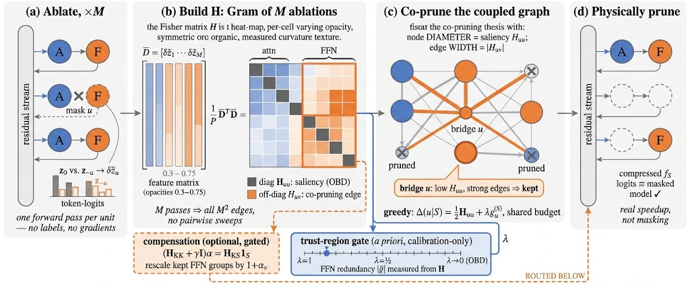

# CoCurve: Cross-Module Co-Pruning Curvature for Training-Free Structured LLM Pruning

[](https://arxiv.org/abs/XXXX.XXXXX)
[](https://gongzhiren.github.io/CoCurve-website/)
[](https://gongzhiren.github.io/CoCurve-website/tutorial.html)
[](LICENSE)

> **Prune the edges, not just the nodes.**

**CoCurve** is a calibration-only, fine-tuning-free method for structured pruning of decoder-only
LLMs that prunes attention heads and feed-forward (FFN) channel groups **jointly**. Most training-free
methods rank units independently, implicitly treating the loss from pruning a set as the sum of its
individual losses — a view that fails for Transformers, whose sublayers are coupled through a shared
residual stream. Two individually weak units can be jointly indispensable, and independent scoring is
blind to it.

A second-order Taylor expansion of the token-level KL between the frozen model and its masked copy
yields a single Fisher matrix **H** whose diagonal is classical node saliency and whose off-diagonal
entries are **co-pruning curvature edges**: the extra damage of removing two units together. Under a
single-ablation additivity approximation, this matrix reduces to a Gram product of single-unit ablation
features, so the full `M × M` interaction is recovered from **`M` forward passes** — no pairwise
sweeps, no gradients. Pruning is then a single budgeted quadratic program, solved in one shot under a
shared attention–FFN budget, with **no labels, fine-tuning, or recovery**.



## Installation

```bash
python -m venv .venv
source .venv/bin/activate
pip install -r requirements.txt
export PYTHONPATH=src
```

The package lives under `src/cocurve`; exporting `PYTHONPATH=src` makes `import cocurve` available.

## Repository layout

- `src/cocurve/` — core package (unit registry, calibration, ablation, Fisher matrix, solver,
  physical pruning, evaluation)
- `scripts/` — thin, single-stage pipeline entrypoints
- `configs/` — YAML configuration files
- `assets/` — figures

Model weights, calibration data, and generated outputs are **not** shipped in this repository. Place
model weights under `models/<key>` (paths are referenced in `configs/model.yaml`); pipeline artifacts
are written under a `--run-dir` you choose.

## Reproducing the method

### 1. Build the calibration set

Calibration follows standard pruning practice: raw C4/WikiText-style LM text selects the mask, while
downstream benchmarks are kept separate for evaluation.

```bash
python scripts/build_calibration_mix.py --project-root . \
  --source c4 --fallback-source wikitext2 \
  --num-samples 128 --holdout-samples 32 --seq-len 2048 \
  --tokenizer models/llama-3.1-8b
```

### 2. Run the staged pruning pipeline

Each script runs only its named stage and reuses artifacts from the same `--run-dir`. If a prerequisite
artifact is missing, the pipeline raises a clear error instead of silently recomputing prior stages.

```bash
RUN=outputs/experiments/llama-3.1-8b/dev_run
CFG=configs/default.yaml

python scripts/run_collect_full.py   --config $CFG --run-dir $RUN   # 1. full-model calibration logits
python scripts/run_unit_ablations.py --config $CFG --run-dir $RUN   # 2. single-unit ablation features
python scripts/run_build_H.py        --config $CFG --run-dir $RUN   # 3. co-pruning curvature matrix H
python scripts/run_greedy_prune.py   --config $CFG --run-dir $RUN   # 4. budgeted co-pruning QP
python scripts/run_eval_pruned.py    --config $CFG --run-dir $RUN   # 5. quality gates + JSON benchmarks
python scripts/run_apply_mask.py     --config $CFG --run-dir $RUN   # 6. physical structural removal
```

Or run everything at once:

```bash
python scripts/run_pipeline.py --config configs/default.yaml --stages all \
  --run-dir outputs/experiments/llama-3.1-8b/dev_run
```

The prune ratio and cross-module interaction strength (`interaction_strength`, i.e. the weight of the
off-diagonal edge term) are set in `configs/pruning.yaml`.

### 3. Evaluate

```bash
# Standard perplexity + zero-shot task suite (optionally with an active mask)
python scripts/run_standard_eval.py --config configs/default.yaml \
  --model-key llama-3.1-8b --run-dir $RUN --mask-run-dir $RUN --tasks all

# Real (not masked) inference efficiency after structural removal
python scripts/run_efficiency_eval.py --config configs/default.yaml \
  --model-key llama-3.1-8b --run-dir $RUN
```

## Configuration

`configs/default.yaml` composes the modular configs:

- `model.yaml` — model registry (path, family, dtype)
- `calibration.yaml` — calibration sources and ablation settings
- `pruning.yaml` — units, curvature matrix, and solver (prune ratio, per-layer cap, first/last-layer
  protection, interaction strength)
- `eval.yaml` — benchmarks and quality gates
- `datasets.yaml` — dataset catalog

## Notes

- No LoRA recovery or fine-tuning is used anywhere in the pipeline.
- `H` is stored in float32 and built from token-subsampled Fisher features.
- Physical pruning removes whole units so the compressed model runs faster on commodity hardware;
  its logits match the masked model to numerical tolerance.

## Citation

```bibtex
@article{gong2026cocurve,
  title   = {CoCurve: Cross-Module Co-Pruning Curvature for Training-Free Structured LLM Pruning},
  author  = {Gong, Zhiren and Zeng, Zihao and Wang, Zijie and Wang, Tiantong and Yuen, Chau and Lim, Wei Yang Bryan},
  journal = {arXiv preprint arXiv:XXXX.XXXXX},
  year    = {2026}
}
```

## License

Released under the [MIT License](LICENSE).
